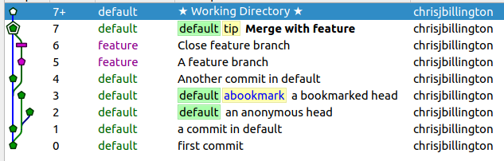
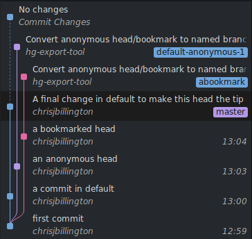

hg-export-tool
=====================

This is a short script to run `hg-fast-export` on a list of mercurial repositories to
convert them to git repositories. It is pretty simple, it just automates the process of
running `hg-fast-export.sh` on a potentially large number of repositories. If there are
anonymous heads, it first adds a commit to give them a unique branch name by appending
`-anonymous-<n>` to their existing branch names, with n a unique integer. If such a head
has a bookmark, the bookmark name will be used instead. This ensures these heads survive
the conversion to git

This script uses Python 2 because `hg-fast-export` is Python 2 only at present.

Requirements
============

To use this tool, you'll need Python 2.7 with the mercurial module installed. You will
also need the `git` and `hg` commands to be in your path, such that they function from
the command line. On Windows, you will need to install Git for Windows in order to have
git bash, which is needed by `hg-fast-export`.

To install mercurial, run: `pip install mercurial`, or use your system's package manager
to install the mercurial libraries for Python 2.

To get this script, clone or download this repository.


Usage
=======

Run this script as `python2 exporter.py REPO_MAPPING_FILE [args ...]`

where `REPO MAPPING FILE` is the path to a file containing JSON mapping filepaths of
mercurial repositories to the desired filepaths of the resulting git repositories, for
example:

```json
{
    "example.hg": "example.git",
    "/some/other/repo.hg": "/some/other/repo.git"
}
```

The git repositories must not already exist. If the filepaths in this file are relative
paths, they will be interpreted relative to the directory containing the repo mapping
file.

All remaining arguments will be passed to invocations of `hg-fast-export.sh`. One
argument you will probably want to use is `-A` to pass an author map file. To get a list
of authors present in the mercurial commits, run the `list-authors.py` script as
`python2 list-authors.py REPO_MAPPING_FILE`. This will output a file `authors.map` in
the same directory as the repo mapping file, in the correct format for passing to
`hg-fast-export.sh` with the `-A` argument. You can modify this file to fill in the
desired git commit names and emails by editing on the right side of the equals sign on
each line, otherwise `<devnull@localhost>` will be used for all unknown email addresses
(the default behaviour of `hg-fast-export`).

On Windows, you will need to tell the script the path to git bash so that it may run
`hg-fast-export` using it. You can do this by passing an additional argument as follows:

```bash
python2 exporter.py --bash="C:\Program Files\Git\bin\bash.exe" REPO_MAPPING_FILE [args ...]`
```

Where the path is the location of git bash on your system


What it does
============

This script will, for each mercurial repo in the `REPO_MAPPING_FILE`:

1. Make a temporary copy of the mercurial repository
2. When a branch has more than one head, make empty branch commits such that each extra
   head has a child commit with a unique branch name
3. ensure the destination git repository directory exists
4. run `git init` in in the destination repository
5. `cd` to the destination git repository directory
6. Run `hg-fast-export.sh -r <hg_repo_path> [args ...]`, passing all  arguments that
   were passed  to 
7. run `git checkout master` to put the git repository into a clean state.


Example
=======

An example is included in this repository, of a mercurial repository
`example/example.hg`, which looks like this in `tortoisehg`:


There is a repo mapping file `example/repo_mapping.json` with
the following contents:
```json
{
    "example.hg": "example.git"
}
```

Note: Due to some line-ending weirdness I am not familiar with, when cloing this
repository on Windows, the example mercurial repository appears as having uncommitted
changes. Revert them before continuing, as mercurial with otherwise refuse to operate on
this repository:
```bash
hg update -C -R example/example.hg
```

First we create an author mapping file:
```bash
python2 list-authors.py example/repo_mapping.json
```

This outputs a file `example/authors.map` containing the following:
```
"chrisjbillington"="chrisjbillington <devnull@localhost>"
```
Which we might edit to change `devnull@localhost` to an actual email address, before
running:
```bash
python2 exporter.py example/repo_mapping.json -A example/authors.map
```

And our new git repository has been created at `example/example.git`, which looks
like the following in Sublime merge:




FAQ
===

Q. What's wrong with github's mercurial import?

A. It doesn't import anonymous heads, and it gets the order of parents of merge commits
   wrong randomly, resulting in an incorrect concept of which branch was merged into
   which, causing less-than-useful diffs for merge commits.

Q. Doesn't functionality like this properly belong in `hg-fast-export`?

A. Yes, but I'm in a hurry to get this stuff working to port my own repositories, and
   it's easier to wrap `hg-fast-export` than to understand it well enough to modify it.

Q. This is all pretty annoying, isn't it?

A. Yes
